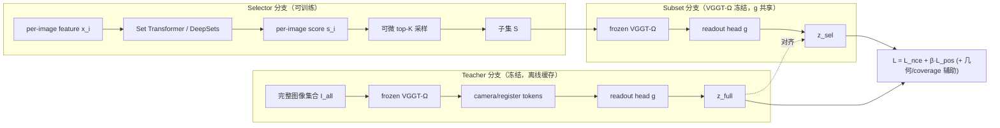
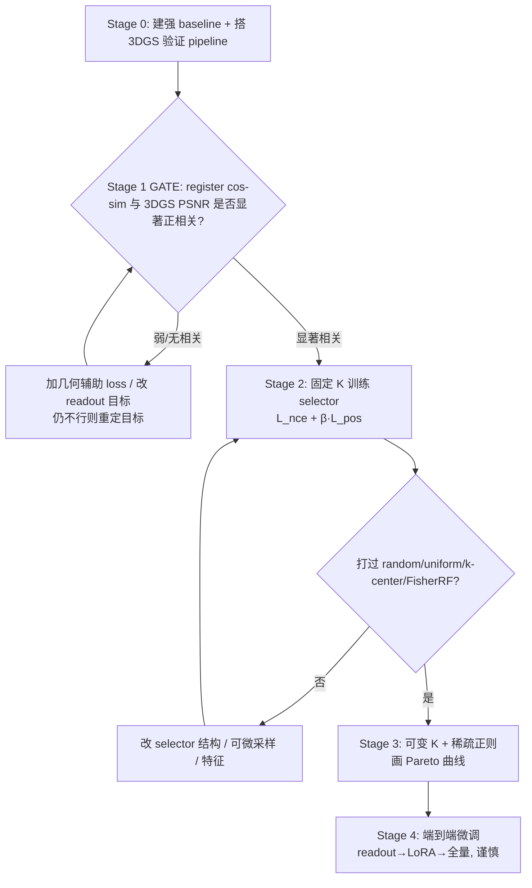

# VGGT-Ω Register Token 驱动的数据子集选择 —— Research 报告

> 日期：2026-06-03
> 状态：对 [`VGGT_OMEGA_subset_selection_proposal.md`](VGGT_OMEGA_subset_selection_proposal.md) 的深度评估与修订版
> 配套文档：[`proposal_review_and_corrections.md`](proposal_review_and_corrections.md)（精简版「评价 + 更正 + 建议」）

---

## 0. 本报告的事实核查说明（先读）

本报告的所有事实性陈述均经过一次多源联网核查（fan-out 搜索 → 抓取一手页面 → 对抗式投票核验）。为避免把"听起来合理"当成"已证实"，全文采用如下置信度标注：

- **[已核实]** —— 由 arXiv 一手页面 / 官方 GitHub / 官方主页等一手来源逐字证实。
- **[论文宣称]** —— 仅核实到"论文/主页这样写"，公开材料未给出可独立复核的实验证据。
- **[需核实]** —— 当前无足够一手证据，列为开放问题，落地前需读源码或补实验。

> ⚠️ 核查局限：本轮 `WebSearch` 工具全程报 400 故障，核查几乎完全依赖直取一手页面（arXiv API XML、官方 repo raw、主页），**缺少独立第三方对抗式检索覆盖**。对"存在性 / 元数据"类结论，一手来源已足够；对"性能 / SOTA"类结论请保持谨慎。另：多个 WebFetch 助手因知识截止早于 2026-05 而误判 VGGT-Ω 为"伪造的 future-dated ID"，该误判已被 arXiv 原始 XML、官方 GitHub、主页、HuggingFace 四源逐字推翻 —— 当前日期 2026-06-03，arXiv 2605（2026 年 5 月）属于过去/现在，编号有效。

---

## 1. 背景（Background）

### 1.1 问题土壤：机器人 / VLA 数据中的视角冗余

面向机器人的 VLA（Vision-Language-Action）训练与三维场景重建都建立在大规模、多视角图像之上，而同一场景内的图像往往高度冗余：视角重复、运动模糊、纹理贫乏、遮挡严重，或对全局几何覆盖贡献极小。能否**自动选出一个尽可能小、但仍保留完整数据集全局 3D 几何理解能力的图像子集**，对降低下游 3DGS / VLA 的训练与存储成本有直接价值。这正是本方案要解决的问题。

### 1.2 技术土壤：几何 foundation model 与 register token 的演化

- **VGGT（Visual Geometry Grounded Transformer）** **[已核实]**
  CVPR 2025 **Best Paper**，arXiv:[2503.11651](https://arxiv.org/abs/2503.11651)，Oxford VGG + Meta AI。它是一个**纯视觉/几何** foundation model：单次前馈即可从 1 到数百张视图，在约 1 秒内直接推断相机参数、depth map、point map、3D point track，性能超过需要后处理几何优化的传统方法。
  关键事实：VGGT 本身**不是 VLA / 语言模型**；其架构借鉴了 register token，但**register 的输出在原版中被显式丢弃**，相机位姿由独立的 camera token 预测。因此原版 VGGT **不原生暴露任何"场景级 register embedding"**。

- **VGGT-Ω（VGGT-OMEGA）** **[已核实]**
  arXiv:[2605.15195](https://arxiv.org/abs/2605.15195)，2026-05-14 提交，**CVPR 2026 Oral**，原 VGGT 团队（Jianyuan Wang 等，Oxford VGG + Meta AI）的正式后继工作。官方代码 [github.com/facebookresearch/vggt-omega](https://github.com/facebookresearch/vggt-omega)，主页 [vggt-omega.github.io](https://vggt-omega.github.io/)。**三处均为真实一手来源**。
  论文摘要逐字确认两项核心机制：
  > "We also use **registers to aggregate scene information into a compact representation** and introduce **register attention**, which restricts inter-frame information exchange to these registers, in part replacing global attention."

  这直接支撑本方案"用 registers 作为场景级几何表征载体"的立论基础。

- **register token 的起源** **[已核实]**
  ICLR 2024 Oral，"Vision Transformers Need Registers"，arXiv:[2309.16588](https://arxiv.org/abs/2309.16588)（Darcet 等）。其**原始动机**是吸收 ViT 推理时在低信息背景区出现的 high-norm 伪影 token，从而得到更干净的特征图/注意力图、改善稠密预测。原文**全文无** VLA / robot / camera pose / 3D reconstruction 字样。
  含义：register 作为"全局信息载体"是后来被 VGGT 系**扩展赋能**的，并非 register 机制的固有属性。本方案把 VLA / 语言能力归因于 VGGT-Ω 而非 2309.16588，**归因正确**。

- **DUSt3R / MASt3R 系无位姿稠密重建** **[已核实]**
  DUSt3R，arXiv:[2312.14132](https://arxiv.org/abs/2312.14132)，CVPR 2024。可从任意未标定、未知位姿的图像集做稠密 3D 重建（位姿/标定作为输出而非输入），在单一框架下统一单目与双目。它说明"sparse-view 重建可不依赖位姿先验"，为本方案的 selector 输入与 teacher 构造提供了替代路径。

### 1.3 方法土壤：子集选择与视角选择是成熟领域

本方案并非凭空立题，其上游有两条成熟的研究线（详见第 3 节）：经典 **coreset / 数据子集选择**（Sener-Savarese、CRAIG、GradMatch）与三维重建中的**视角选择**（Skeletal Sets、FisherRF）。

---

## 2. 目的（Objectives）

### 2.1 核心问题

> 给定一个离线图像集合 $I=\{I_1,\dots,I_N\}$，学习一个 selector，在预算 $|S|=K \ll N$ 或稀疏约束下选出子集 $S$，使 $S$ 经**冻结的 VGGT-Ω + readout head** 得到的场景级 register embedding $z_{sel}$ 尽量逼近完整集合的 embedding $z_{full}$；并验证用 $S$ 做 3DGS 重建时 PSNR/SSIM/LPIPS 等指标相对完整集合或强基线仍保持良好。

### 2.2 问题的正确定位

应定位为 **"预算化几何覆盖选择"（budgeted geometric-coverage selection）**，而**不是**一开始就定义成 RL 问题。RL（样本效率低、reward 延迟、每步重跑 VGGT-Ω/3DGS 成本高）只适合作为后期 refinement。

### 2.3 立项的硬门槛（critical gate）

整个方案最关键、且决定能否立项的假设是：

> **"register embedding 距离越小 ⇒ 下游 3DGS 重建质量越好"**

这一假设**[需核实]** —— 目前**没有任何理论或文献保证**（依据见 §3.2 / §3.3 / §5.2）。因此本报告把"经验验证该相关性"提升为 **Stage 1 的 hard gate**：相关性不达标，则不投入后续 selector 训练。

---

## 3. 相关研究进展（Related Work）

> 下列引用均经一手来源核实。每条附"与本方案的关系"以界定可复用边界与 novelty。

### 3.1 几何 foundation model 与 registers

| 工作 | 出处 | 与本方案的关系 |
|---|---|---|
| VGGT | [2503.11651](https://arxiv.org/abs/2503.11651), CVPR'25 Best Paper **[已核实]** | 提供"冻结 backbone 取几何特征"的前提；但 register 输出被丢弃，**不原生暴露 scene embedding** |
| VGGT-Ω | [2605.15195](https://arxiv.org/abs/2605.15195), CVPR'26 Oral **[已核实]** | 本方案的 backbone；registers + register attention 是立论基础 |
| Registers in ViT | [2309.16588](https://arxiv.org/abs/2309.16588), ICLR'24 **[已核实]** | register 概念来源；原义是去伪影，全局信息载体是后续扩展 |
| DUSt3R | [2312.14132](https://arxiv.org/abs/2312.14132), CVPR'24 **[已核实]** | 无位姿稠密重建；可作 teacher / selector 输入的替代路径 |

### 3.2 数据子集 / coreset 选择

| 工作 | 出处 | 核心思想 |
|---|---|---|
| Active learning as core-set | Sener & Savarese, [1708.00489](https://arxiv.org/abs/1708.00489), ICLR'18 **[已核实]** | 把子集选择形式化为 **k-Center 覆盖**；Thm1 在 Lipschitz 假设下用覆盖半径界住模型自身损失 |
| CRAIG | Mirzasoleiman 等, [1906.01827](https://arxiv.org/abs/1906.01827), ICML'20 **[已核实]** | 用 **submodular facility-location** 最大化做**梯度匹配** coreset |
| GradMatch | Killamsetty 等, [2103.00123](https://arxiv.org/abs/2103.00123), ICML'21 **[已核实]** | 用 **OMP** 选子集使其梯度匹配 train/val 全梯度 |

> ⚠️ **形式错配（必须澄清以免过度类比）**：经典 coreset 的目标是"**在子集上重新训练模型**仍有竞争力"；本方案的目标是"**冻结模型**下子集 embedding 逼近全集 embedding（不重训）"。两者相关但不同范式。
> ⚠️ 不要照搬"GradMatch 一致优于其他方法"这类强结论 —— 该论断在本轮核查中被**否决（0-3）**，缺乏支撑。

### 3.3 三维重建中的视角选择

| 工作 | 出处 | 选择准则 |
|---|---|---|
| Skeletal Sets | Snavely/Seitz/Szeliski, [项目页](https://www.cs.cornell.edu/~snavely/projects/skeletalset/), CVPR'08 **[已核实]** | **几何 / 重建鲁棒性 + 覆盖**的图算法；从冗余集选 skeletal 子集（如 Trafalgar Square 2973→277），重建子集后再注册其余 |
| FisherRF | Jiang/Lei/Daniilidis, [2311.17874](https://arxiv.org/abs/2311.17874) **[已核实]** | 用 **Fisher Information** 量化 radiance field 参数信息，按 **Expected Information Gain** 选下一视角 |

> ⚠️ **范围错配**：Skeletal Sets 是经典 SfM，**保留全部 N 张**并把其余注册进重建；本方案只用 K 张做 sparse-view 3DGS 并以 PSNR/SSIM/LPIPS 验证。它是"选代表性子集做高效重建"的先例，但**不是**本方案"仅用 K 张 + embedding 作质量代理"那一具体设计的先例。
> 💡 **关键对照**：Skeletal Sets 与 FisherRF 都用**几何 / 信息论准则**选视角，**没有一个用全局 embedding 距离**。这恰恰说明本方案"用 learned embedding 距离作准则"是一条**未经验证的新路径**，其 novelty 也正在于此（见 §3.7）。

### 3.4 sparse-view 3DGS / NeRF

| 工作 | 出处 | 与本方案的关系 |
|---|---|---|
| FSGS | [2312.00451](https://arxiv.org/abs/2312.00451) **[已核实存在]** | few-shot 3DGS；验证"少量视图重建可行但困难" |
| SparseGS | [2312.00206](https://arxiv.org/abs/2312.00206) **[已核实存在]** | sparse-view 3DGS 正则；可作下游验证 pipeline |
| InstantSplat | Fan 等, [2403.20309](https://arxiv.org/abs/2403.20309) **[已核实]** | 用**几何 foundation model 初始化** + joint pose 优化；引入 **co-visibility-based geometry initialization** 去冗余 |

> 💡 InstantSplat 的 **co-visibility** 去冗余机制，与本方案"选代表性视角"目标高度相关，可同时作为**强基线**与**下游 3DGS pipeline**复用。

### 3.5 可微子集选择 / 可微 top-K

| 工作 | 出处 | 机制 |
|---|---|---|
| Gumbel-Softmax | Jang 等, [1611.01144](https://arxiv.org/abs/1611.01144) **[已核实]** | 单 item 可微采样 |
| Stochastic Beams / Gumbel-Top-k | Kool 等, [1903.06059](https://arxiv.org/abs/1903.06059) **[已核实]** | top-k 采样 |
| **Reparameterizable Subset Sampling** | **Xie & Ermon, [1901.10517](https://arxiv.org/abs/1901.10517), IJCAI'19** **[已核实]** | 把 Gumbel-max **从单 item 扩展到子集**的可微采样；用于 feature selection / stochastic kNN |
| **SOFT top-k（OT）** | **Xie 等, [2002.06504](https://arxiv.org/abs/2002.06504)** **[已核实]** | 把 top-k 写成**熵正则最优传输**问题，按 EOT 最优性条件求梯度 |
| **Differentiable Patch Selection** | **Cordonnier 等, [2104.03059](https://arxiv.org/abs/2104.03059), CVPR'21** **[已核实]** | 用可微 Top-K（perturbed 风格）**从图像选 patch 子集**，端到端训练 |

> 💡 原 proposal 第 8 节只列了 Gumbel-Softmax 与 Gumbel-Top-k。上面**加粗三项**才是与"选图像子集再端到端蒸馏"最贴合的现代方法 —— 尤其 **Reparameterizable Subset Sampling**（直接的可微子集采样）和 **Differentiable Patch Selection**（"选视觉单元子集"的工程范式）。建议优先评估这两者，而非停留在 straight-through top-K。

### 3.6 对比学习与表征蒸馏

CPC/InfoNCE（[1807.03748](https://arxiv.org/abs/1807.03748)）、CLIP（[2103.00020](https://arxiv.org/abs/2103.00020)）、SimCLR（[2002.05709](https://arxiv.org/abs/2002.05709)）**[已核实存在]**。为"full-set 与 subset embedding 作正样本对、batch 内其他 scene 作负样本"的 symmetric InfoNCE 提供依据。

### 3.7 Novelty 定位（本方案相对已有工作的位置）

综合上表，本方案的新颖组合是：

> **"VGGT-Ω register readout embedding 作几何代理" × "learned + 可微 top-K selector" × "用 sparse-view 3DGS 质量验证"**

- 相对 **Skeletal Sets / FisherRF**：选择准则从"几何 / 信息论"换成"learned embedding 距离" —— 这是**差异点也是风险点**，必须证明 embedding 准则不劣于（最好优于）几何/信息论准则。
- 相对 **coreset（Sener-Savarese 等）**：从"重训模型"换成"冻结模型 embedding 逼近"，且对象是**多视角几何**而非分类样本。
- 相对 **sparse-view 3DGS（InstantSplat 等）**：它们解决"给定少量视图怎么重建好"，本方案解决"**该选哪些视图**"，二者**互补**，可串联。

**[需核实]** 是否已有工作完全等同本组合（用几何 foundation model 全局 embedding + 可微 selector 做 3D 视角子集选择）—— 本轮 WebSearch 故障未能穷尽检索，立项前建议补一轮针对性查新。

---

## 4. 本算法方法（Proposed Method，修订版）

> 总体沿用 proposal 的三分支设计，但吸收 §1–§3 的核查结论做了关键修正（修正点以 **🔧** 标出）。

### 4.1 总体架构

### 4.2 关键修正（基于核查）

1. 🔧 **register token 数量是可配置项，不是固定 16** **[已核实：论文/代码未给固定值]**。代码以 `camera_and_register_tokens[..., :1]` 取 camera token、`[..., 1:]` 取 registers，**register 数量应从配置 / checkpoint 实读**，不要在代码里写死 17（=1+16）。

2. 🔧 **scene-level readout embedding 必须自训练，VGGT-Ω 不原生提供** **[已核实]**。proposal 第 33 行"先用 readout head 聚合再比较"的设计是**必要补救而非现成功能**，应在报告/代码中明说，并把 `RegisterReadoutHead` 列为需训练模块。

3. 🔧 **"registers 携带语义 / 可用于 VLA / 语言对齐"应表述为"论文宣称"** **[论文宣称]**。摘要确有此说，但：(a) 公开材料**未给出 VLA benchmark / 消融**；(b) 语言对齐**可能是独立的 `text_alignment_embedding`（`enable_alignment=True`）而非 register token 的固有属性**（核查中相关论断投票 1-2，存疑未决）。
   → **[需核实]** 落地前**直接读** `vggt_omega/models/heads/text_alignment_head.py`，确认其 readout 思路能否**脱离语言目标**迁移到几何表征蒸馏（这是 proposal 第 67 行设计可行性的边界）。

4. 🔧 **核心假设须先验证**：见 §2.3 与 §5.2，作为 Stage 1 gate。

### 4.3 Readout Head

仿 VGGT-Ω `TextAlignmentHead`：`[B, N, R+1, C]` register/camera tokens → reshape → 拼接 1 个 learnable readout token → 数层 self-attention → 取 readout token → 投影 → L2 normalize。MVP 用 1 个 readout token + 2–4 层 self-attention。R（register 数）从配置实读（见修正 1）。

### 4.4 Loss

- **主损失**：`L = L_nce + β·L_pos`
  - `L_nce`：symmetric InfoNCE（对角线正样本、非对角线负样本，双向 CE）。
  - `L_pos`：`1 - cos(z_sel, z_full)`（embedding 已 L2 normalize，cosine 优先于 MSE）。
- **稀疏项**（可变 K 阶段）：`+ λ·Σ p_i`。
- **可选 coverage**：facility-location 风格 `Coverage(S)=Σ_j max_{i∈S} sim(x_i,x_j)`，缓解"选一堆相似图"。
- **可选几何辅助**（仅在 §5.2 相关性弱时启用）：depth（log 尺度对齐）、relative pose（Procrustes / 测地距离）、point-map（scale-aligned）。MVP **不启用**，避免过早增加复杂度。

### 4.5 离散选择：可微 top-K 选型（修订）

优先级（替代 proposal 仅用 straight-through 的方案）：

1. **Reparameterizable Subset Sampling**（[1901.10517](https://arxiv.org/abs/1901.10517)）—— 直接的可微子集采样，最贴合"选 K 张图"。
2. **Perturbed top-K / Differentiable Patch Selection**（[2104.03059](https://arxiv.org/abs/2104.03059)）—— "选视觉单元子集"的成熟工程范式。
3. **SOFT top-K（OT）**（[2002.06504](https://arxiv.org/abs/2002.06504)）—— 平滑稳定，适合作消融对照。
4. straight-through top-K / Gumbel-Top-K —— 作为简单基线。

> ⚠️ **前向不可分的现实**：子集"真正送进冻结 VGGT-Ω"是离散选择，无论哪种松弛，梯度都是有偏估计。MVP 可先用 **soft-mask 聚合**（在 readout 前对 token 加权）拿到稳定信号，再切换到真实离散选择并比较 train/eval gap。

### 4.6 输入特征与两种部署语义（必须二选一并说清）

- **离线数据集压缩**（推荐起点）：selector 输入可用"完整集合过 VGGT-Ω 后的每帧 register summary"——更强，但**选择前已跑过完整 VGGT-Ω**，**省不了 VGGT 推理成本**，只省后续 3DGS/VLA 训练成本。
- **降低 VGGT 推理成本**：selector 必须改用**更便宜的 image-only 特征**（DINO/CLIP），不能依赖完整 VGGT tokens。

> proposal 第 11.4 节已点出此区别，本报告将其前置为**方法设定的第一选择**，因为它决定了 selector 输入与整个故事的卖点。

---

## 5. Baseline 与迭代计划（Roadmap）

### 5.1 强 Baseline（learned selector 必须打得过）

经典：① Random-K ② Uniform stride-K ③ DINO/CLIP feature k-center ④ VGGT register embedding k-center ⑤ Facility-location greedy（CRAIG 风格）⑥ Pose farthest-point sampling ⑦ 图像质量过滤 + coverage ⑧ Skeletal-Sets 风格 overlap 图选择。

🔧 **新增现代基线**：
- ⑨ **FisherRF**（[2311.17874](https://arxiv.org/abs/2311.17874)）信息增益视角选择 —— 直接对照"信息论准则 vs embedding 准则"。
- ⑩ **InstantSplat co-visibility**（[2403.20309](https://arxiv.org/abs/2403.20309)）去冗余初始化。

### 5.2 迭代计划与 Decision Gates

- **Stage 0｜建底座**：实现 §5.1 全部 baseline；搭好 3DGS（可复用 SparseGS/InstantSplat）评测，固定 PSNR/SSIM/LPIPS/pose-ATE-RPE/depth-err 指标与场景级 train/val/test 划分（**同场景不跨 split**）。
- **Stage 1｜立项 GATE（最重要）**：在小规模数据上，对多种 selector × 多个 K，画 **register cos-sim ↔ 3DGS PSNR 的散点 / 相关系数**。
  - 通过标准（建议）：Spearman ρ ≥ 0.5 且方向稳定。
  - **不通过则不进入 Stage 2** —— 先补几何辅助 loss / 换 readout 目标；若仍无相关，说明"全局 embedding 距离"不是合适代理，需重定目标（如直接优化几何/重建代理）。
- **Stage 2｜固定 K selector**：冻结 VGGT-Ω，训练 selector + readout，`L_nce + β·L_pos`。GATE：相同 K 下稳定 **优于 random/uniform/k-center/FisherRF**。
- **Stage 3｜可变 K + 最小集合**：加 `λ·|S|`，画 Pareto 曲线（x=K/N，y=PSNR/SSIM/LPIPS/sim）；在阈值内（如 PSNR drop ≤ 1dB、SSIM drop ≤ 0.02、LPIPS ↑ ≤ 0.02）取最小 K。
- **Stage 4｜端到端（谨慎）**：顺序为 readout 解冻 → VGGT-Ω 后几层加 LoRA/adapter → 最后才全量。全量微调成本高且可能破坏 VGGT-Ω 原有几何能力，**不作为起点**。

### 5.3 数据组织

每个 sample 是一个完整场景/视频：`scene_id/{images, optional_poses, optional_depths, optional_masks, metadata.json}`。覆盖 indoor/outdoor、object/scene-centric、small/wide baseline、static/dynamic、texture rich/poor、clean/blur、dense/sparse view。**按场景划分 split**，避免同场景帧泄漏高估泛化。

### 5.4 风险与失败模式

| 失败模式 | 表现 | 缓解 |
|---|---|---|
| 语义多样但几何不足 | 偏好语义变化大的图，忽略基线/overlap/纹理 | 加 pose diversity / matching coverage / 3DGS proxy |
| 视角分散但 overlap 不足 | SfM/3DGS 初始化困难 | diversity 与 overlap 平衡 |
| **embedding 近但局部细节差** | 全局表征忽略局部 | patch-level coverage / depth confidence / 局部匹配 loss（**根因即 §2.3 软肋**） |
| selector 依赖 full VGGT tokens | 省不了 VGGT 推理成本 | 见 §4.6，目标若是省 VGGT 推理则换便宜特征 |
| InfoNCE false negative | 不同场景相似被当负样本 | 增大 batch 多样性 / 避免近似场景同 batch / soft label / 配 cosine 正样本 |
| **前向不可分梯度偏差** | 离散选择与松弛目标有 gap | soft-mask 暖启动 → 真实离散，监控 train/eval gap |

---

## 6. 推荐结论

1. **方案基石成立**：VGGT-Ω 真实、registers/register attention 真实，proposal 引用无造假，整体方向有扎实研究价值。
2. **从简单起步**：冻结 VGGT-Ω → fixed-K selector → `symmetric InfoNCE + cosine` → 3DGS 验证。**不从 RL 开始**。
3. **立项以 Stage 1 GATE 为准**：先证明 register 距离与 3DGS 质量显著相关，再投入 selector 训练。这是全案成败的关键。
4. **选型现代化**：可微采样优先 Reparameterizable Subset Sampling / perturbed top-K；baseline 必须含 FisherRF、InstantSplat co-visibility。
5. **诚实表述**：VLA/语言对齐写成"论文宣称"，并读 `text_alignment_head.py` 源码确认 readout 可迁移性；register 数按配置实读。

---

## 7. 参考文献（均经一手来源核实，标注置信度）

**几何 foundation model 与 registers**
- VGGT, arXiv:[2503.11651](https://arxiv.org/abs/2503.11651), CVPR'25 Best Paper **[已核实]**
- VGGT-Ω (VGGT-OMEGA), arXiv:[2605.15195](https://arxiv.org/abs/2605.15195), CVPR'26 Oral; code [facebookresearch/vggt-omega](https://github.com/facebookresearch/vggt-omega); 主页 [vggt-omega.github.io](https://vggt-omega.github.io/) **[已核实存在与架构；VLA/语言对齐为论文宣称]**
- Vision Transformers Need Registers, arXiv:[2309.16588](https://arxiv.org/abs/2309.16588), ICLR'24 **[已核实]**
- DUSt3R, arXiv:[2312.14132](https://arxiv.org/abs/2312.14132), CVPR'24 **[已核实]**

**coreset / 数据子集选择**
- Active Learning core-set, arXiv:[1708.00489](https://arxiv.org/abs/1708.00489), ICLR'18 **[已核实]**
- CRAIG, arXiv:[1906.01827](https://arxiv.org/abs/1906.01827), ICML'20 **[已核实]**
- GradMatch, arXiv:[2103.00123](https://arxiv.org/abs/2103.00123), ICML'21 **[已核实存在；"一致优于他法"被否决]**

**三维重建中的视角选择**
- Skeletal Sets, [Cornell 项目页](https://www.cs.cornell.edu/~snavely/projects/skeletalset/), CVPR'08 **[已核实]**
- FisherRF, arXiv:[2311.17874](https://arxiv.org/abs/2311.17874) **[已核实]**

**sparse-view 3DGS / NeRF**
- FSGS, arXiv:[2312.00451](https://arxiv.org/abs/2312.00451) **[已核实存在]**
- SparseGS, arXiv:[2312.00206](https://arxiv.org/abs/2312.00206) **[已核实存在]**
- InstantSplat, arXiv:[2403.20309](https://arxiv.org/abs/2403.20309) **[已核实]**

**可微子集选择 / top-K**
- Gumbel-Softmax, arXiv:[1611.01144](https://arxiv.org/abs/1611.01144) **[已核实]**
- Gumbel-Top-k / Stochastic Beams, arXiv:[1903.06059](https://arxiv.org/abs/1903.06059) **[已核实]**
- Reparameterizable Subset Sampling, arXiv:[1901.10517](https://arxiv.org/abs/1901.10517), IJCAI'19 **[已核实]**
- SOFT top-k (Optimal Transport), arXiv:[2002.06504](https://arxiv.org/abs/2002.06504) **[已核实]**
- Differentiable Patch Selection, arXiv:[2104.03059](https://arxiv.org/abs/2104.03059), CVPR'21 **[已核实]**

**对比学习**
- CPC/InfoNCE, arXiv:[1807.03748](https://arxiv.org/abs/1807.03748) **[已核实存在]**
- CLIP, arXiv:[2103.00020](https://arxiv.org/abs/2103.00020) **[已核实存在]**
- SimCLR, arXiv:[2002.05709](https://arxiv.org/abs/2002.05709) **[已核实存在]**

---

## 附录 A：本轮核查未决的开放问题（落地前需关闭）

1. **[GATE]** VGGT-Ω readout/register embedding 与 3DGS PSNR/SSIM/LPIPS 的相关性究竟多强？（Stage 1，无文献支持，必须自验）
2. VGGT-Ω 语言对齐是 register token 固有属性，还是独立 `text_alignment_embedding`（`enable_alignment=True`）？→ 读 `vggt_omega/models/heads/text_alignment_head.py`。
3. 可微 top-K 选型在"子集真正送进冻结 VGGT-Ω"这一前向不可分设置下，Reparameterizable Subset Sampling / perturbed-topk / SOFT-topk 哪种最稳？需小实验对比。
4. 是否已有等同本组合（几何 foundation model 全局 embedding + 可微 selector 做 3D 视角子集选择）的工作？需补一轮查新以确认 novelty（本轮 WebSearch 故障未穷尽）。
